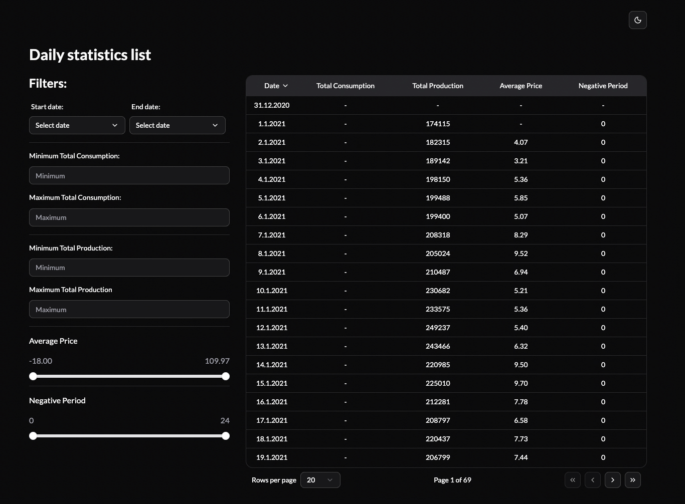
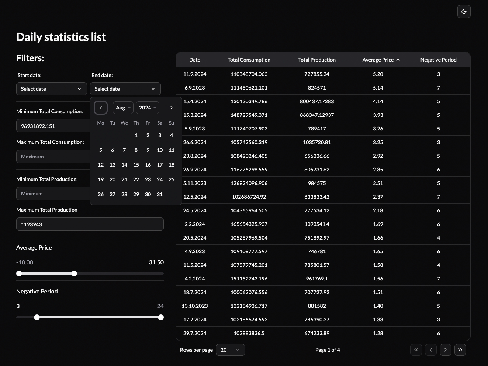
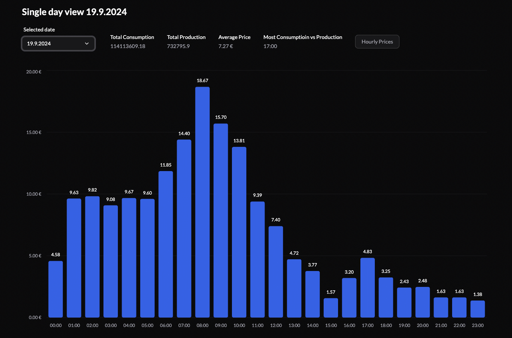
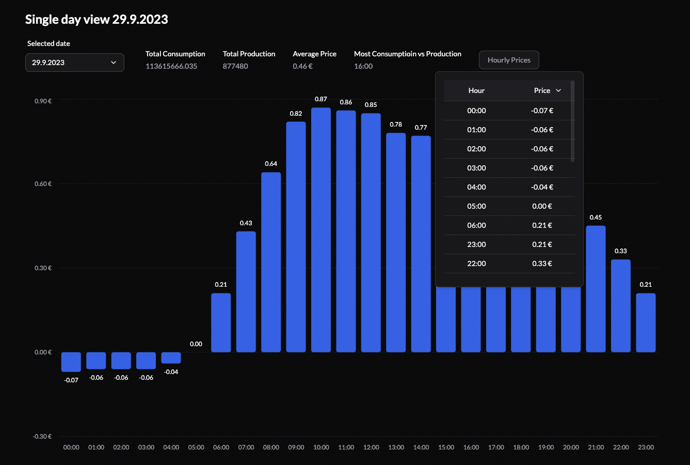

# REST API and Dashboard exercise

I came across this awesome [exercise](https://github.com/solita/dev-academy-spring-2025-exercise) while browsing Solita’s website and looking for information about their Dev Academy. The application period had already ended, but I decided to complete the exercise just for fun.

The application is currently deployed at https://dev.pinkkila.com (best viewed on desktop).

## Backend

- REST API built with Spring Boot.
- Supports sorting, pagination, and filtering via query parameters.
- Includes examples of unit, JSON serialization, controller, JDBC, and integration/end-to-end tests.


## Frontend

- Dashboard build with React.
- Styled using shadcn/ui and Tailwind CSS.
- Data fetching with TanStack Query providing:
  - Caching
  - Loading and error handling


## How to run

Before running the project, make sure you have the following installed:
- Docker — for running the backend service in a container. 
- Java 21 — required if you prefer to run the backend locally instead of using Docker.
- Node.js and npm — for building and running the frontend.

### Backend (Spring Boot)

- Ensure Docker is installed and running on your machine.
- From the project root, start the backend service with the following command:

```
docker compose -f compose.backend.yaml up --build
```

This command builds the backend image (if needed) and starts the container.
Once running, the REST API will be available at `localhost:8080/api/electricity`.

#### Available endpoints

1. `GET /api/electricity`

Fetches daily electricity statistics with support for filtering, pagination, and sorting.

2. `GET /api/electricity/day/{date}`

Fetches data for a specific date.

##### Query Parameters

| Category                   | Parameters                                                                       |
|:---------------------------|:---------------------------------------------------------------------------------|
| Date range                 | startDate, endDate                                                               |
| Total Consumption          | minTotalConsumption, maxTotalConsumption                                         |
| Total Production           | minTotalProduction, maxTotalProduction                                           |
| Average Price              | minAveragePrice, maxAveragePrice                                                 |
| Consecutive Negative Hours | minConsecutiveNegativeHours, maxConsecutiveNegativeHours                         |
| Pagination                 | page, size (default size = 20)                                                   |
| Sorting                    | date, consecutiveNegativeHours, totalConsumption, totalProduction, averagePrice  |


##### Example Request

```
http://localhost:8080/api/electricity?startDate=2021-05-15&minConsecutiveNegativeHours=4&page=0&size=20&sort=consecutiveNegativeHours,asc
```


### Frontend (React + Vite)

- Navigate to the frontend directory and start the Vite development server:

```
cd frontend
npm install
npm run dev
```

Vite will start the development server at `localhost:5173`.

## UI images







